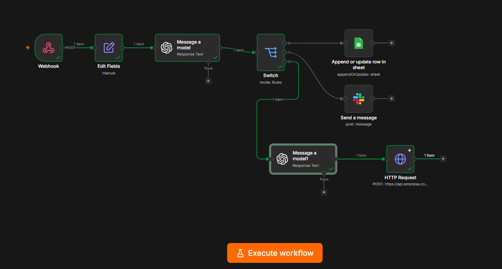
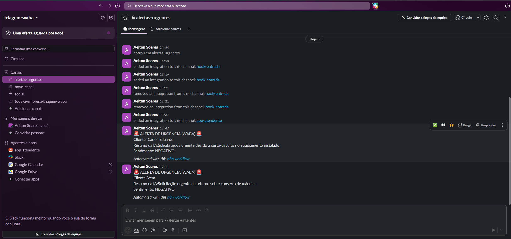
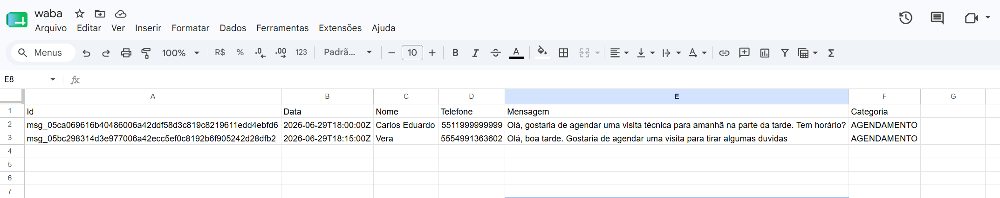

# 🤖 Pipeline Inteligente de Triagem e Operações Ágeis (n8n + IA)

## 📋 Sobre o Projeto
Este projeto simula uma **Camada Ágil de Operações**, atuando como um orquestrador central para automação de atendimento via WhatsApp Business API (WABA). Utilizando **n8n** integrado a modelos de Inteligência Artificial (OpenAI), o sistema recebe mensagens não estruturadas, compreende o contexto, classifica a intenção do cliente e roteia a demanda para o sistema correto de forma 100% autônoma.

O objetivo do fluxo é **eliminar gargalos operacionais**, reduzir o tempo de primeira resposta (SLA) e garantir que a equipe humana atue apenas no que é crítico.

---

## 🛠️ Arquitetura e Fluxo de Decisão

O pipeline foi construído para ser modular, resiliente e escalável. O fluxo de ponta a ponta segue as seguintes etapas:

1. **Gateway de Entrada (Webhook):** Escuta ativa de requisições HTTP POST simulando o recebimento de mensagens do WhatsApp/Trinks, com payloads estruturados em formato JSON.
2. **Sanitização de Dados (Edit Fields):** Tratamento das variáveis de entrada para garantir que apenas os dados essenciais (Nome, Telefone, Mensagem) sejam processados, descartando metadados desnecessários de rede.
3. **Motor Cognitivo (OpenAI via Prompt Engineering):** Um nó de LLM (`gpt-4o-mini`) configurado com regras estritas de sistema para devolver **exclusivamente um objeto JSON**. A IA analisa o sentimento e categoriza a intenção em três rotas:
   * `AGENDAMENTO`
   * `SUPORTE_URGENTE`
   * `DUVIDA_FAQ`
4. **Roteamento Dinâmico (Switch):** Avaliação condicional baseada na saída da IA para direcionamento da carga de trabalho.
5. **Ações Integradas (Destinos):**
   * **Fluxo de Agendamento:** Insere os dados estruturados diretamente no **Google Sheets** (simulando um CRM ou banco de dados operacional).
   * **Fluxo de Urgência:** Dispara um alerta imediato via Webhook para a equipe interna no **Slack / Discord**, garantindo ação rápida.
   * **Fluxo FAQ Autônomo:** Uma segunda chamada à IA consome um "manual de operações" no prompt, gera uma resposta humanizada e simula o envio de volta ao cliente via HTTP Request.

---

## 🚀 Tecnologias e Habilidades Aplicadas

* **Orquestração:** n8n (Self-hosted via Docker).
* **IA & Engenharia de Prompt:** Integração com OpenAI API, forçando saídas estruturadas em JSON para previsibilidade sistêmica.
* **Integração de Sistemas:** Google Workspace API (OAuth2), Slack/Discord Webhooks, simulação de APIs RESTful.
* **Manipulação de Dados:** Tratamento avançado de JSON, extração de variáveis, mapeamento dinâmico (`{{ $json... }}`).
* **Lógica Ágil:** Condicionais, tratamento de falhas e visão focada em experiência do cliente e eficiência interna.

---

## 📸 Demonstração Visual




---

## 📦 Como Replicar este Workflow

1. Clone este repositório.
2. Certifique-se de ter uma instância do n8n ativa (Cloud ou Docker local).
3. No painel do n8n, vá em `Workflows` > `Import from File` e selecione o arquivo `workflow_triagem_ia.json` contido neste repositório.
4. Configure as suas próprias credenciais nos nós que exigem autenticação:
   * Chave de API da OpenAI.
   * OAuth2 do Google Cloud Console (para o Sheets).
   * URL do Webhook do Slack ou Discord.
5. Ative o workflow e dispare payloads de teste utilizando ferramentas como Postman, cURL ou Insomnia para o endpoint gerado no nó de Webhook.

### Exemplo de Payload de Teste (JSON)
```json
{
  "id_interacao": "evt_001",
  "cliente": "Carlos Eduardo",
  "telemovel": "+5511999999999",
  "mensagem": "O equipamento acabou de dar um curto-circuito e parou tudo aqui na loja! Alguém me ajuda urgente!",
  "canal": "WABA"
}
